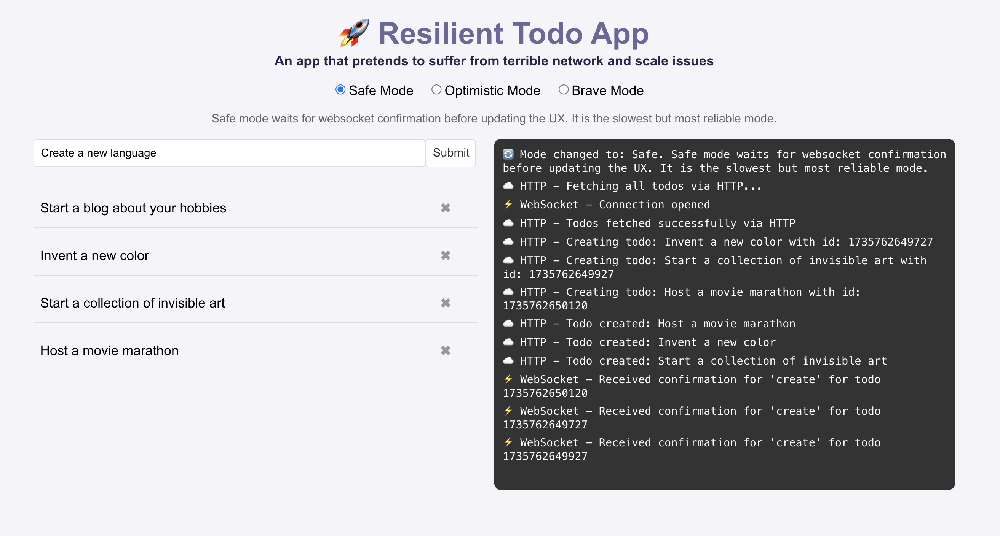
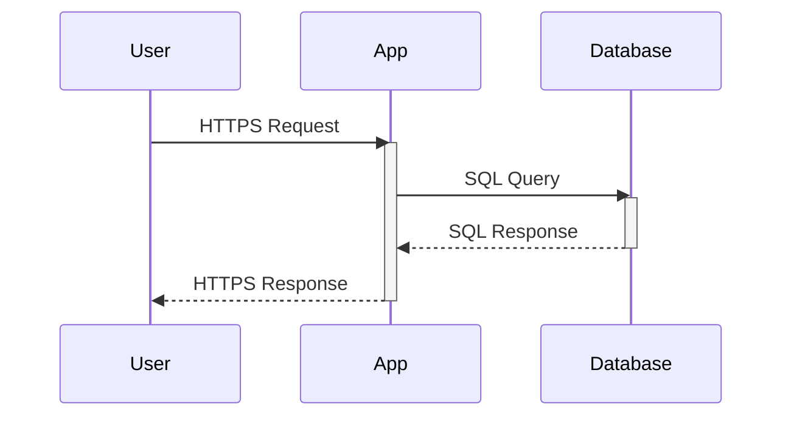
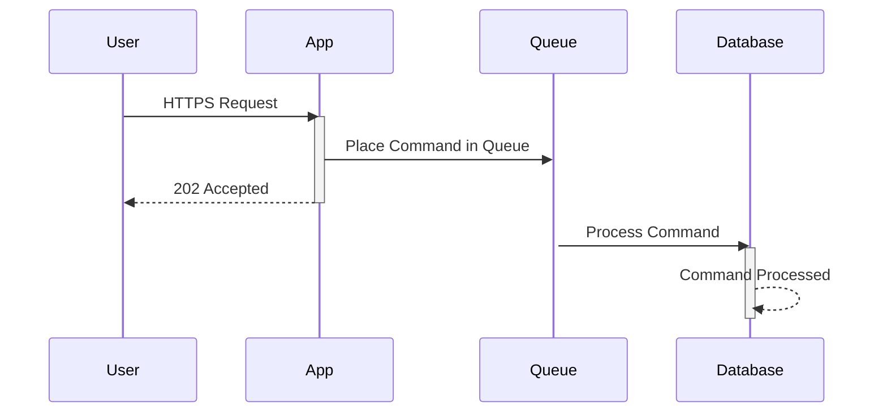
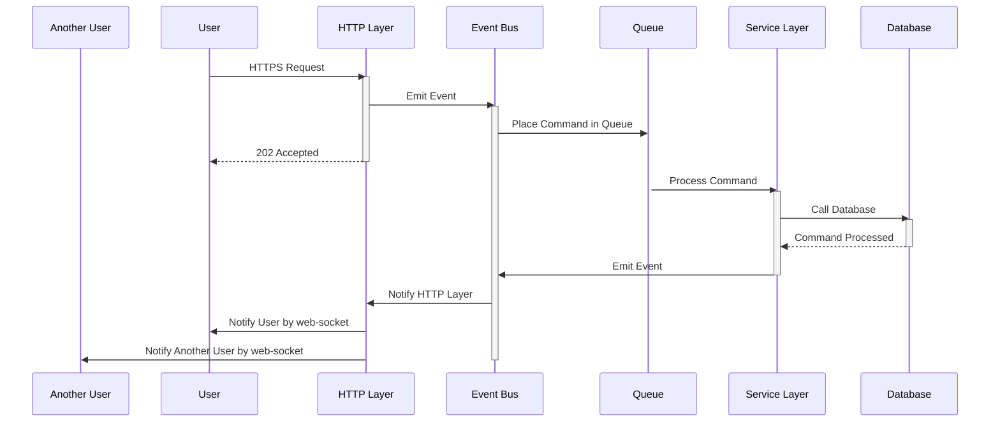
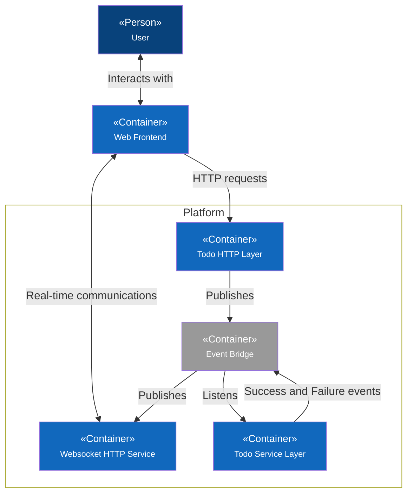

# Event Driven Frontends



This project is a simple React application that demonstrates using WebSockets to update an event-driven backend with eventual consistency. It shows how real-time communication can be established between a client and server, and how data consistency is maintained over time. In AWS, when data is stored behind a queue, direct confirmation of data being saved is not possible. Instead, a 202 (request accepted) is returned, and later, the service responsible for saving the record emits an event to notify the frontend.

This example separates the HTTP reception of commands from backend processing, following the CQRS pattern. It uses a simulated queue and delays to mimic lengthy command processing. To enhance realism, random 500 errors and exponential backoff for API calls are simulated, representing poor internet or transient service issues. This repo is not an exercise in creating a sophisticated frontend or API. It uses a basic Rect app to illustrate eventual consistency and error recovery concepts.

## Features

- Real-time updates using WebSockets
- (Fake) Event-driven backend architecture, with queues
- Demonstrates eventual consistency in a web application
- Random deliberate 500 errors that we recover from with retrys in the frontend

## Start the demo

```bash
npm i
npm run api
npm run start
```

# 🤔 Why Though?

## Problems



In a synchronous application, we make a call to the application, then we hold the connection open while we wait for the atomic transaction to be returned to us. See the vertical line on the `App`? Thats how lont your HTTP request takes. What happens if the `Database` is slow. Tough luck, your API request takes longer. I've seen API to create records in busy apps take minutes. Thats just not good enough.

In an event driven system using cqrs or similar, we do not receive confirmation that a command has changed the data as requested via the HTTP layer. The best we can hope for is strong contract validation and a 202, request accepted for processing.



Notice how we returned early? We simploy cannot hold the connection open since the queue is decoupled.

If an error occurs related to your command, such as an internal failure in a downstream service then we cannot be informed due to the decoupled nature of even driven microservices. 

## Opportunities 

If somebody else changes either the record you are looking at, the page you are on, or even a single field you both occupy then we can now let them know, enabling real time collaboration. The same mechanism used to confirm your update went through can also be used to inform others who care about the record you uodated that it has changed. If we play it smart, we get multiplayer for almost free.



We got our message to our user when our queue item was processed, but it's getting complicated right?

## Moving parts

To allow the user to receive messages from internal services, we are going to need a few things.

First, on the frontend application, we will need a mechanism to receive WebSocket messages. This is so that real-time messages from services, either success messages or failure messages, can be displayed to the user or used to influence the UX. We'll need some components here, such as toast popups with appropriate colors to handle both errors and successes.

Next, we need a service to handle our WebSocket connections. In cloud providers such as AWS, their API Gateway offers this out of the box. WebSockets are a standard, so whatever your architecture, you'll be able to create something for your front end to connect to and receive messages from.

Your WebSocket-enabled endpoint will need to store the active connections so that other services in your event-driven system don't need to worry about it. Here are the goals of your WebSocket service:

- To allow users to connect to a WebSocket
- To store their socket ID alongside their internal user ID
- To listen to events in the system destined for a specific user ID and send it to their socket ID

### Why translate the socket ID into a user ID?

A socket ID is ephemeral. Regardless of the user's logged-in state, refreshing the browser will change the socket ID. A user across two different windows won't share the same socket ID either. We need a way to determine the ID from the user. So we use a lookup. It only makes sense to store a list of active sockets against a user since it's possible they have more than one window open to the application.

This means that any other service we have in our platform no longer needs to worry about WebSockets. All it has to do is take the outcome of a command and the ID of a user who cares about that outcome and emit a regular event to the service bus about it. We've decoupled the WebSockets and delegated the complexity to a single service and fulfilled the single responsibility principle.

## Standards

Let's agree on a message-passing standard between the frontend and the backend socket server. In our main use case, which is receiving updates about database interactions, we're going to need two schemas.

## Modes of Operation

In the example React application, I give three modes.

- `Safe`: Safe mode waits for websocket confirmation before updating the UX. It is the slowest but most reliable mode.
- `Optimistic`: Optimistic mode waits for HTTP confirmation before updating the UX and ignores websocket confirmation. This is how most web apps work.
- `Brave`: Brave mode waits for neither websocket nor HTTP confirmation before updating the UX. This is the most performant and dangerous mode.

The basic difference is how the todo add or delete is confirmed. I do a really basic opacity change and waiting spinner to let the user know that something is happening with that specific todo item, your UX should be much smarter than this example.

| Mode | WebSocket Confirmation | HTTP Confirmation | UX Update Timing |
|------------|------------------------|-------------------|---------------------------|
| Safe | ✅ Yes | ✅ Yes | After WebSocket confirmation |
| Optimistic | ❌ No | ✅ Yes | After HTTP confirmation |
| Brave | ❌ No | ❌ No | Immediately |

As you can imagine, in scenarios where you must know if osmething went through and is stored, you cannot ever use `Brave` (or foolish depending on your perspective) because adding a todo item then closing the browser means data will be lost.

### The internal status schema

This is an object that can be emitted by any service in the platform. It must contain the user ID of the target user and a payload of data destined for that user. This event is specifcally to send messages to the frontend users, it will be triggered after a success message from the todo service. This a very important distinction.

```json
{
    "user-id": "68ebe6d8-2764-44c6-9b84-3e63a276e758",
    "action": "todo-create",
    "payload": {
        "todo-id": "a994c5ff-7c4d-4086-bb1f-817c928bad98",
        "todo-text": "Take the bins out"
    }
}
```
- `user-id` - Something in your platform to identify the user. In the sockets service we will swap this for their current socket-id. They may have multiple socket-id, since they might have multiple browser windows open and we need this message to go to all of them.
- `action` - This will be passed into the frontend app. It lets the app know what context the payload will be applied to.
- `payload` - This is the data that will be passed into the function handling the action in the frontend.

### The front-end payload schema

After we have traded our user ID for our socket ID, we can now target the correct browser window for that user. This schema will be the payload from the first schema. We will add some structure to this payload so the front end has an easier time using it, with things such as the success or failure of the command, and helpful keys like a timestamp and the entity ID we target to update in the UX.

```json
{
    "todo-id": "a994c5ff-7c4d-4086-bb1f-817c928bad98",
    "todo-text": "Take the bins out"
}
```

In this case, we see that `todo-id` and `todo-text` are recognised by the frontend application and they are to be used in the `todo-create` function. We can imagine that this function might add this `todo` to the list locally.

## Architecture



- `User` - Somebody who will be both creating and reading todo
- `Web Frontend` - A visual interface for the todo
- `Websocket HTTP Service` - A websocket http gateway to send realtime messages to the user
- `Todo HTTP Layer` - A way for the frontend to create events in event bridge with security
- `Todo Service Layer` - A service to store todo, that reacts to todo commands
- `Event Bridge` - A bus that handles inter service events, decoupling the services

## FAQ Section

### Q: What is the purpose of the `todo-id` and `todo-text` in the front-end socket schema?
A: The `todo-id` and `todo-text` are recognized by the frontend application and are used in the `todo-create` function. This function adds the `todo` to the list locally. Similarly, deleting and updating for example, has its own schema.

### Q: How does the user interact with the system?
A: The user interacts with the system through the Web Frontend, which is a visual interface for managing todos.

### Q: What role does the Websocket HTTP Service play in the architecture?
A: The Websocket HTTP Service acts as a gateway to send real-time messages to the user, enabling real-time communications between the Web Frontend and the backend services.

### Q: Why is the HTTP Layer separate from the Service Layer?
A: The HTTP Layer is separate from the Service Layer to promote a clear separation of concerns. The HTTP Layer is responsible for handling incoming HTTP requests, performing authentication and authorization, and exposing endpoints to the Web Frontend. On the other hand, the Service Layer is focused on the business logic, managing and processing todos, and reacting to commands. This separation allows each layer to be developed, tested, and maintained independently, leading to a more modular and scalable architecture.

### Q: How does the Todo HTTP Layer ensure security?
A: The Todo HTTP Layer provides a secure way for the frontend to create events in the Event Bridge, ensuring that only authorized actions are performed.

### Q: What is the function of the Todo Service Layer?
A: The Todo Service Layer is responsible for storing todos and reacting to todo commands, ensuring that todos are managed and updated correctly.

### Q: What is the Event Bridge and why is it important?
A: The Event Bridge is a bus that handles inter-service events, decoupling the services. It allows different services to communicate and react to events without being directly dependent on each other, promoting a more modular and scalable architecture.

### Q: How does the Todo HTTP Layer handle queries?
A: The Todo HTTP Layer handles queries by exposing endpoints that the Web Frontend can call. These endpoints allow the frontend to retrieve todos by calling the todo service. The HTTP Layer ensures that all requests are authenticated and authorized before processing them.

### Q: How does the Todo HTTP Layer interact with the Todo Service Layer?
A: The Todo HTTP Layer interacts with the Todo Service Layer by making internal API calls. When a request is received from the Web Frontend, the HTTP Layer processes the request and then calls the appropriate function in the Todo Service Layer to perform the required action, such as retrieving single or list of todo.

### Q: How does the Todo HTTP Layer ensure the integrity of the data?
A: The Todo HTTP Layer ensures the integrity of the data by validating all incoming requests and ensuring that they meet the required criteria using JSON schema. It also handles any necessary data transformations and sanitizations before passing putting any commands on the Event Bridge. Additionally, it ensures that all actions are performed within the context of the authenticated user, maintaining data consistency and security.

# Resiliencey

## Methods to Improve Web Application Resilience

### **Retry Logic**
Implement retry mechanisms to automatically reattempt failed API requests after a certain interval. You can retry on queries `GET` and commands `PUT/POST/DELETE` all the same.

### **Exponential Backoff**
Use exponential backoff strategy to gradually increase the wait time between retries, reducing the load on the server.

```js
delay * Math.pow(2, i)
```
This is a simple implementation of an exponential backoff strategy, which is commonly used in network programming to manage retries after a failure. This means that with each retry, the delay time increases exponentially.

### **Caching**
Cache responses from API calls to serve data even when the network is down or the API is unresponsive. Our HTTP layer is seperate, remember that.

### **Graceful Degradation**
Design the application to maintain core functionality even when some services are unavailable. Have the UX degrade gracefully by removing elements that can not be used given the current outage, for example. Talk to your UX designer for great ideas here.

### **Offline Mode**
Enable offline mode to allow users to continue using the application with limited functionality and sync data when the connection is restored.  This feature of browsers is frequently forgotten. You can also use the offline state and degrade the UX gracefully.

```js
window.addEventListener("offline", (event) => {
  // do something when we go offline
});

window.addEventListener("online", (event) => {
  // do something when we come back online
});
```

### **Timeouts and Circuit Breakers**
Set appropriate timeouts for API requests and use circuit breakers to prevent the application from waiting indefinitely for a response. Different browsers can set these to different times, or even leave the connection open, so be sure to specify a timeout to your request and treat it as a failure.

### **Fallback Mechanisms**
Provide fallback mechanisms to handle failures gracefully, such as showing default data or user-friendly error messages. Keep the user in the loop. Stop them from angrily refreshing the browser or rage clicking buttons.

### **Monitoring and Alerts**
Implement monitoring and alerting systems to detect and respond to issues with APIs and network connectivity promptly. This one is for your platform team to help you with. If an API or a service is down, while the user is receiving your verbally delightful error messages, you need to be alerted so you can fix it. If you're lucky, then you might find the problem before the customer does.

### **Progressive Enhancement**
Build the application with progressive enhancement to ensure that it works on varying network conditions and devices. For example, you can start with a basic HTML structure that works without JavaScript, then add JavaScript enhancements for better interactivity. Additionally, you can implement service workers to cache static assets and API responses, allowing the app to function offline.

# Final word

Building a resilient web app means ensuring it handles failures gracefully, maintains core functionality, and provides a seamless user experience even under adverse conditions. Implement retry logic, exponential backoff, caching, graceful degradation, offline mode, timeouts, circuit breakers, fallback mechanisms, monitoring, alerts, and progressive enhancement. Resilience is not just a feature; it's essential for a robust and user-friendly application.

Anybody can put up a database and a frontend, but not every team can build something that scales and works well even under stress and failures. Hopefully this document helps you get there.

- Lee Nattress - Architect


