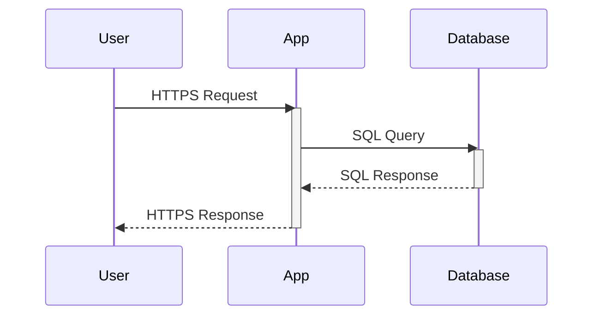
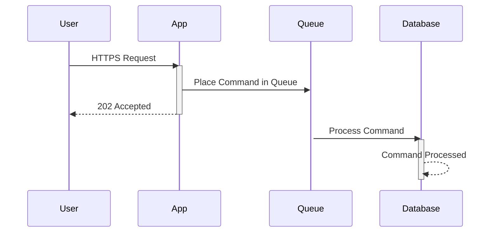
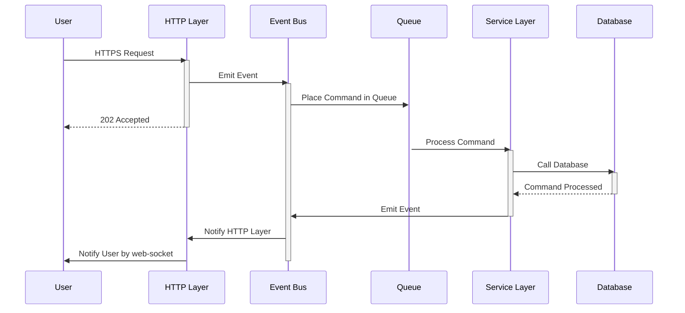

# Event Driven Frontends

This project is a simple React application that demonstrates using WebSockets to update an event-driven backend with eventual consistency. It shows how real-time communication can be established between a client and server, and how data consistency is maintained over time. In AWS, when data is stored behind a queue, direct confirmation of data being saved is not possible. Instead, a 202 (request accepted) is returned, and later, the service responsible for saving the record emits an event to notify the frontend.

This example separates the HTTP reception of commands from backend processing, following the CQRS pattern. It uses a simulated queue and delays to mimic lengthy command processing. To enhance realism, random 500 errors and exponential backoff for API calls are simulated, representing poor internet or transient service issues. This repo is not an exercise in creating a sophisticated frontend or API. It uses a basic Rect app to illustrate eventual consistency and error recovery concepts.

## Features

- Real-time updates using WebSockets
- (Fake) Event-driven backend architecture, with queues
- Demonstrates eventual consistency in a web application
- Random deliberate 500 errors that we recover from with retrys in the frontend

## Start the demo

```bash
npm i
npm run api
npm run start
```

# 🤔 Why Though?

## Problems



In a synchronous application, we make a call to the application, then we hold the connection open while we wait for the atomic transaction to be returned to us. See the vertical line on the `App`? Thats how lont your HTTP request takes. What happens if the `Database` is slow. Tough luck, your API request takes longer. I've seen API to create records in busy apps take minutes. Thats just not good enough.

In an event driven system using cqrs or similar, we do not receive confirmation that a command has changed the data as requested via the HTTP layer. The best we can hope for is strong contract validation and a 202, request accepted for processing.



Notice how we returned early? We simploy cannot hold the connection open since the queue is decoupled.

If an error occurs related to your command, such as an internal failure in a downstream service then we cannot be informed due to the decoupled nature of even driven microservices. 

## Opportunities 

If somebody else changes either the record you are looking at, the page you are on, or even a single field you both occupy then we can now let them know, enabling real time collaboration. The same mechanism used to confirm your update went through can also be used to inform others who care about the record you uodated that it has changed. If we play it smart, we get multiplayer for almost free.



We got our message to our user when our queue item was processed, but it's getting complicated right?

## Moving parts

To allow the user to receive messages from internal services, we are going to need a few things.

First, on the frontend application, we will need a mechanism to receive WebSocket messages. This is so that real-time messages from services, either success messages or failure messages, can be displayed to the user or used to influence the UX. We'll need some components here, such as toast popups with appropriate colors to handle both errors and successes.

Next, we need a service to handle our WebSocket connections. In cloud providers such as AWS, their API Gateway offers this out of the box. WebSockets are a standard, so whatever your architecture, you'll be able to create something for your front end to connect to and receive messages from.

Your WebSocket-enabled endpoint will need to store the active connections so that other services in your event-driven system don't need to worry about it. Here are the goals of your WebSocket service:

- To allow users to connect to a WebSocket
- To store their socket ID alongside their internal user ID
- To listen to events in the system destined for a specific user ID and send it to their socket ID

### Why translate the socket ID into a user ID?

A socket ID is ephemeral. Regardless of the user's logged-in state, refreshing the browser will change the socket ID. A user across two different windows won't share the same socket ID either. We need a way to determine the ID from the user. So we use a lookup. It only makes sense to store a list of active sockets against a user since it's possible they have more than one window open to the application.

This means that any other service we have in our platform no longer needs to worry about WebSockets. All it has to do is take the outcome of a command and the ID of a user who cares about that outcome and emit a regular event to the service bus about it. We've decoupled the WebSockets and delegated the complexity to a single service and fulfilled the single responsibility principle.

## Standards

Let's agree on a message-passing standard between the frontend and the backend socket server. In our main use case, which is receiving updates about database interactions, we're going to need two schemas.

### The internal status schema

This is an object that can be emitted by any service in the platform. It must contain the user ID of the target user and a payload of data destined for that user.

### The front-end socket schema

After we have traded our user ID for our socket ID, we can now target the correct browser window for that user. This schema will be the payload from the first schema. We will add some structure to this payload so the front end has an easier time using it, with things such as the success or failure of the command, and helpful keys like a timestamp and the entity ID we target to update in the UX.


